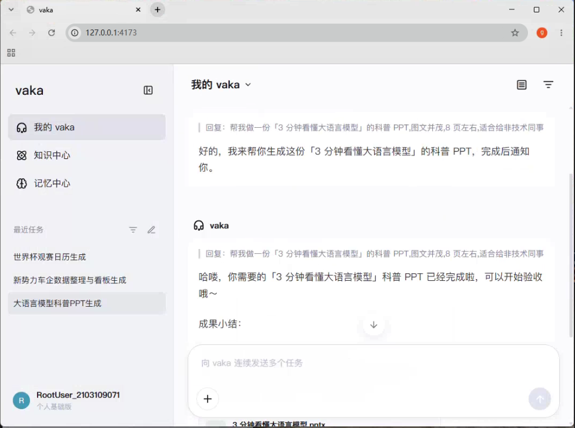
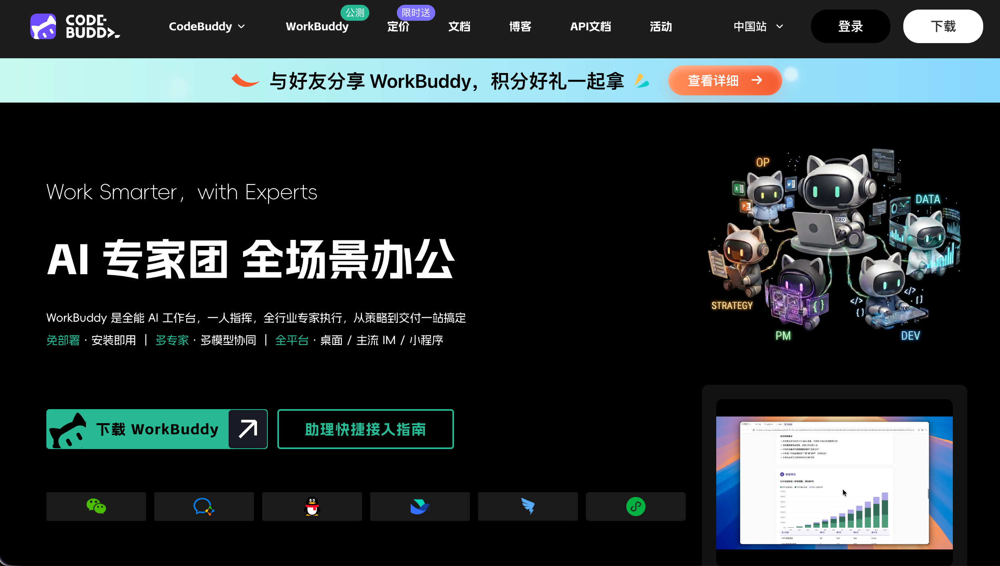

# React UI Replica Series

使用 React 和 Vite 构建的 UI 复刻系列。每个项目拥有独立路由、响应式布局与可操作的界面状态。

## 系列项目

| 项目 | 路由 | 说明 |
| --- | --- | --- |
| Vaka Chat | `/vaka` | AI 聊天工作台，支持会话发送、任务切换与消息弹层 |
| WorkBuddy | `/codebuddy-work` | AI Agent 产品长页，支持移动导航、活动横幅、下载菜单与平滑导航 |

系列入口位于 `/`。

## Vaka Chat



## WorkBuddy



## 本地运行

```bash
npm install
npm run dev
```

## 构建

```bash
npm run build
```
